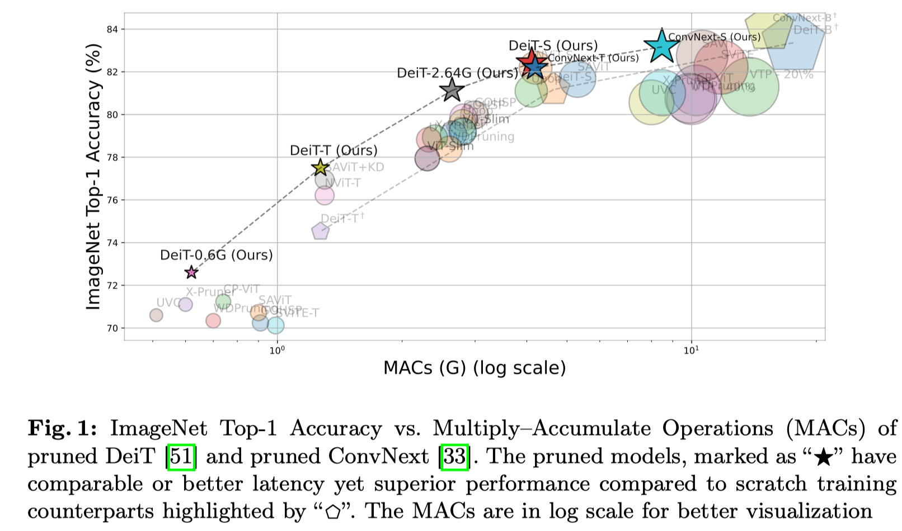
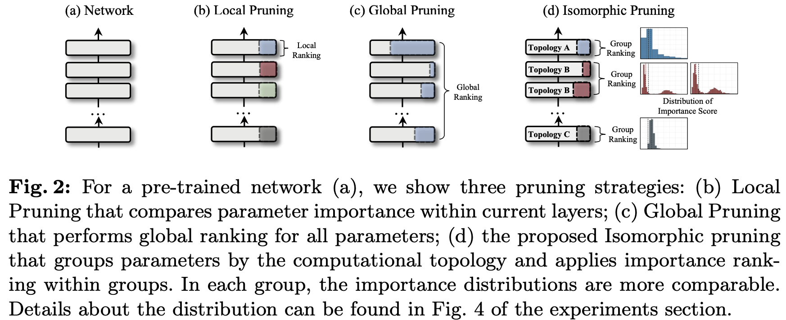

# Isomorphic Pruning

Official implementation of the ECCV'24 paper [Isomorphic Pruning for Vision Models]().

> [**Isomorphic Pruning for Vision Models**]()   
> *[Gongfan Fang](https://fangggf.github.io/), [Xinyin Ma](https://horseee.github.io/), [Michael Bi Mi](https://dblp.org/pid/317/0937.html), [Xinchao Wang](https://sites.google.com/site/sitexinchaowang/)*    
> *[Learning and Vision Lab](http://lv-nus.org/), National University of Singapore*

## Intro

<div align="center">


</div>


## Pre-requisites

#### Packages

```bash
pip install -r requirements.txt
```

#### ImageNet
Please prepare the ImageNet dataset as follows:
```
data
├── imagenet
│   ├── train
│   │   ├── n01440764
│   │   ├── n01443537
│   │   ├── n01484850
│   │   ├── n01491361
│   └── val
│   │   ├── n01440764
│   │   ├── n01443537
│   │   ├── n01484850
│   │   ├── n01491361
```


## Quick Start

#### 1. Downloading our pruned models (Optional)
The full list of pruned models can be found [here](https://github.com/VainF/Isomorphic-Pruning/releases/tag/v0.1)

```bash
mkdir pretrained && cd pretrained
wget https://github.com/VainF/Isomorphic-Pruning/releases/download/v0.1/deit_4.2G_isomorphic.pth
```
```
pretrained
├── convnext_small_8.5G_isomorphic.pth
├── convnext_tiny_4.2G_isomorphic.pth
├── deit_0.6G_isomorphic.pth
├── deit_1.2G_isomorphic.pth
├── deit_2.6G_isomorphic.pth
└── deit_4.2G_isomorphic.pth
```

You can evaluate the pruned models using the following command:
```bash
python evaluate.py --model pretrained/deit_4.2G_isomorphic.pth --interpolation bicubic
```
```
MACs: 4.1626 G, Params: 20.6943 M
Evaluating pretrained/deit_4.2G_isomorphic.pth...
100%|███████████████| 782/782 [01:57<00:00,  6.68it/s]
Accuracy: 0.8241, Loss: 0.8036
```


#### 2. Evaluating pre-trained models from Timm

Evaluate the performance of the pre-trained models from Timm on ImageNet validation set.

```bash
bash scripts/evaluation/deit_small_distilled_patch16_224.fb_in1k.sh
```
```
MACs: 4.6391 G, Params: 22.4364 M
Evaluating deit_small_distilled_patch16_224.fb_in1k...
100%|█████████████| 782/782 [02:00<00:00,  6.51it/s]
Accuracy: 0.8117, Loss: 0.7511
```


#### 3. Pruning

Perform isomorphic pruning on the pre-trained models. We use data-driven method to estimate the importance of parameters. It will accumulate the importance scores over multiple batches. 
```bash
bash scripts/pruning/deit_4.2G.sh 
```
```
Summary:
MACs: 17.69 G => 4.17 G
Params: 87.34 M => 20.72 M
Saving the pruned model to output/pruned/deit_4.2G.pth...
```


#### 4. Finetuning

Finetune the pruned model and save the intermediate/latest/best checkpoints under ``output/finetuned``.

```bash
bash scripts/finetuning/deit_4.2G.sh
```

#### 5. Evaluating the pruned model

The pruned model will be saved as a ``.pth`` file with the model definition. We can directly load the ``.pth`` to obain the pruned model. You can also pass the timm model name to the script to download the pre-trained model and evaluate it.
```bash
# bilinear for ResNet and bicubic for other models
python evaluate.py --model PATH_TO_PRUNED_MODEL --interpolation bicubic 
```

## Known Issues

The ConvNext models in our paper were finetuned using the [official implementation](https://github.com/facebookresearch/ConvNeXt). We provide an isolated script ``convnext_train.py`` for ConvNext finetuning and will unify the training scripts in the future.

## Acknowledgement

This implementation is based on [Timm](https://github.com/huggingface/pytorch-image-models) and [Torchvision Reference](https://github.com/pytorch/vision/tree/main/references/classification). 

## BibTeX

```bibtex
@article{fang2024isomorphic,
  title={Isomorphic Pruning for Vision Models},
  author={Fang, Gongfan and Ma, Xinyin Tan and Mi, Michael Bi and Wang, Xinchao},
  journal={arXiv preprint arXiv:},
  year={2024}
}
```
